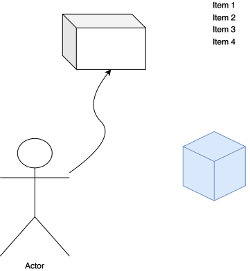

|:-:|
|gambar indo defence|

 **Partitur Ibadah Yom Kippur, 20 September 2026**
-

## Kau Menunggu Hidupku (A-Bb) 

Intro||||
|-|-|-|-|
|1 . . .   |   5/7 . . .   | 6m . . 5 |  4 . . .   |
|1 . . .   |   5/7 . . .   | 6m . . 5 |  4 . . .   |

|Verse 1||||
|-|-|-|-|
|   1 . . .   |   5/7 . . .   | 6m . . .  |  5 . . .   |
| 4 . 5/4 .| 3m . 6m . |  2m . . . |  5 . . .   |

|Verse 2||||
|-|-|-|-|
|   1 . . .   |   5/7 . . .   | 6m . . .  |  5 . . .   |
| 4 . 5/4 .| 3m . 6m . |2m. 2M.|  5 . . .   | 5 . . . |

Chorus||||
|-|-|-|-|
|   1 . . .   |   5/7 . . .   | 6m . . .  | 5 . . 3m|
| 4 . 5/4 .| 3m . 6m . | 2m . . .  |  5 . . 4   |
|   1 . . .   |   5/7 . . .   | 6m . . .  | 5 . . 3m|
| 4 . 5/4 .| 3m . 6m . | 2m . 5 . |

Intro||||
|-|-|-|-|
|   1 . . .   |   5/7 . . .   | 6m . . 5 |  4 . . .   |

Verse 2||||
|-|-|-|-|
| 6m . . .  |    7 . . .     | 1 . . 2m  | 3m . . .|
| 4 . 5/4 .| 3m . 6m . |2m. 2M.|  5 . . .   |

Chorus||||
|:-|-|-|-|
|   1 . . .   |   5/7 . . .   | 6m . . .  | 5 . . 3m|
| 4 . 5/4 .| 3m . 6m . | 2m . . .  |  5 . . 4   |
|   1 . . .   |   5/7 . . .   | 6m . . .  | 5 . . 3m|
| 4 . 5/4 .| 3m . 6m . | 2m . 5 . |

Interlude||||
|:-|-|-|-|
|   1 . . .   |   5/7 . . .   |  6# . . .  | 6m . . . |
|3M/5#...| 1 / 5 . . .  |2M/4#...|2m.3m.|
|  5# . . .   | 4 / 5 . . .  |  **sudah di Bb**

Chorus (Sepi) di Bb||||
|:-|-|-|-|
|   1 . . .   |   5/7 . . .   | 6m . . .  | 5 . . 3m|
| 4 . 5/4 .| 3m . 6m . | 2m . . .  |  5 . . 4   |
|   1 . . .   |   5/7 . . .   | 6m . . .  | 5 . . 3m|
| 4 . 5/4 .| 3m . 6m . | 2m . 5 . |  1 . 5 .  (**Build**)|

Chorus Build up||||
|:-|-|-|-|
|   1 . . .   |   5/7 . . .   | 6m . . .  | 5 . . 3m|
| 4 . 5/4 .| 3m . 6m . | 2m . . .  |  5 . . 4   |
|   1 . . .   |   5/7 . . .   | 6m . . .  | 5 . . 3m|
| 4 . 5/4 .| 3m . 6m . | 2m . 5 . |1.2m 3m|

Coda 2x||||
|-|-|-|-|
| 4 . 5/4 .| 3m . 6m . | 2m . 5 . |1.2m 3m|
| 4 . 5/4 .| 3m . 6m . | 2m . 5 . |  1 . . .| 
| 5 . . . |

**Medley Sbab Kau Besar (Bb-C)**

Chorus||||
|-|-|-|-|
| 1 . . . | 6m . 5 . | 4 . 2m . | 5 . . . |
| 1 . . . | 6m . 5 . | 4 . 2m . | 5 . . . |
| 1 . 5 . |

Chorus||||
|-|-|-|-|
| 1 . . . | 6m . 5 . | 4 . 2m . | 5 . . . |
| 1 . . . | 6m . 5 . | 4 . 2m . | 5 . . . |
| 1 . . . | 6M . . . | **Overtone ke C**

Chorus||||
|-|-|-|-|
| 1 . . . | 6m . 5 . | 4 . 2m . | 5 . . . |
| 1 . . . | 6m . 5 . | 4 . 2m . | 5 . . . |
|  1 7 6m . |

Coda|||||
|-|-|-|-|-|
| 2m . 5 . | 1 7 6m . | 2m . . . | 5 . . . | 1 . . . |

